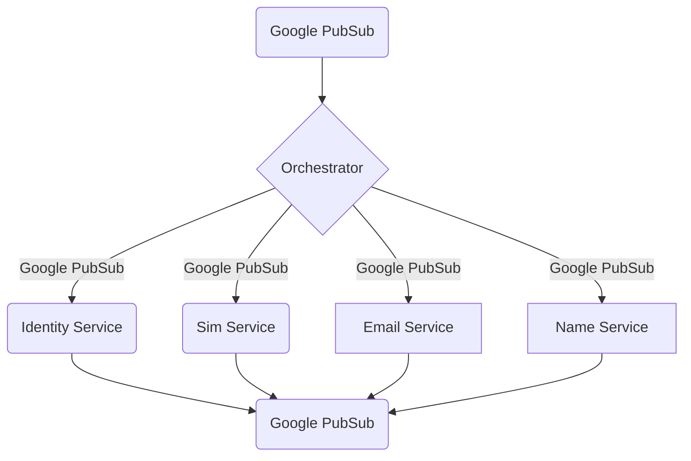

# [Customers Financial Crime Screening Orchestrator](https://questrade.atlassian.net/wiki/spaces/FINCRIME/pages/46956948/FinCrime+Orchestrator)
This repository is a microservice for Financial crime screening Orchestrator.

## Purpose
Orchestrate crime screening between Name,Phone and Email depending on the change to the customer profile

## Executing Integration Tests in Local Environment
Before executing the integration tests locally we'll need to execute the following command in terminal:
```
docker-compose -f ./docker/dev-environment/docker-compose.yml up -d
```

This will create and run one container in background:
- orchestrator_pubsub_local_emulator

Our integration tests will use this emulator to create our temporary topics, subscriptions and to publish any necessary messages to the tests, in a safe and controlled local environment.

## Observability

### Datadog Onboarding Dashboard

- [Dashboard](https://app.datadoghq.com/dashboard/qgq-gc3-wbp/financial-crime---orchestrator)

### Monitors
- [Memory is above 75% of limit for past 5 minutes](https://app.datadoghq.com/monitors/103935629)
- [Excessive errors logged](https://app.datadoghq.com/monitors/103935291)
- [Health Check Failure (drops below 60% of total allocated instances)](https://app.datadoghq.com/monitors/103935481)
- [CPU is above 80% of limit for past 5 minutes](https://app.datadoghq.com/monitors/103935195)

### Logs

[SIT logs](https://app.datadoghq.com/logs?query=service%3Afc-customer-orchestrator%20env%3Asit&additional_filters=%5B%7B%7D%5D&cols=host%2Cservice&index=%2A&messageDisplay=inline&stream_sort=time%2Cdesc&viz=stream&from_ts=1676142931997&to_ts=1678734931997&live=true)

[UAT logs](https://app.datadoghq.com/logs?query=service%3Afc-customer-orchestrator%20env%3Auat&additional_filters=%5B%7B%7D%5D&cols=host%2Cservice&index=%2A&messageDisplay=inline&stream_sort=time%2Cdesc&viz=stream&from_ts=1676142931997&to_ts=1678734931997&live=true)

[PROD logs](https://app.datadoghq.com/logs?query=service%3Afc-customer-orchestrator%20env%3Aprod&additional_filters=%5B%7B%7D%5D&cols=host%2Cservice&index=%2A&messageDisplay=inline&stream_sort=time%2Cdesc&viz=stream&from_ts=1676142931997&to_ts=1678734931997&live=true)

[Logs by env](https://app.datadoghq.com/notebook?tpl_var_message=Published+all+phone+numbers+from) (Datadog notebook)

### Health

[https://fc-customer-orchestrator-default.{env}.q3.questech.io/healthz]({https://fc-customer-orchestrator-default.q3.questech.io/healthz)

## Design

### Specifications


### Dependencies



## Resiliency patterns/degradation features

No resiliency patterns/degradation features added at this point.

## Team Contact Information

Slack channel: #team-tmj

Alerts channel: #customer-fraud-aml-alerts

Confluence page: [Team Tmj](https://confluence.questrade.com/display/CLP/TMJ)

Email: questrade-scrumteam-tmj@questrade.com

## Production readiness

[Checklist link](productionreadiness.md)

## More information

For more information check the [project Confluence page](https://questrade.atlassian.net/wiki/spaces/FINCRIME/pages/46956948/FinCrime+Orchestrator).
